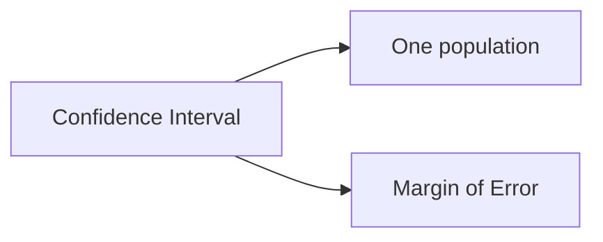

# Chapter 3: Confidence Interval
> written by 20电美刘庆宇

## ① Confidence Interval: One population
|要求|题目|
|-|-|
|$\sigma$ is known|[C7Q1_1](../images/C7Q1_1.PNG)、[C7Q1_2](../images/C7Q1_2.PNG)、[C7Q1_3](../images/C7Q1_3.PNG)、[C7Q2_1](../images/C7Q2_1.PNG)、[C7Q2_2](../images/C7Q2_2.PNG)|
|$\sigma$ is unknown & $n>30$|[C7Q6](../images/C7Q6.PNG)|
|$\sigma$ is unknown & $n<31$|[C7Q3_1](../images/C7Q3_1.PNG)、[C7Q3_2](../images/C7Q3_2.PNG)、[C7Q5](../images/C7Q5.PNG)|
|Proportions |None|
|Variance|[C8Q7_1](../images/C8Q7_1.PNG)、[C8Q7_2](../images/C8Q7_2.PNG)、[C8Q7_3](../images/C8Q7_3.PNG)|

1. Definition: An interval estimate of a parameter is a range used toestimate the parameter. (参数的区间估计是用来估计参数的范围。)
2. Confidence Level:
   - $\alpha$ = probability of making Error I
   - $1-\alpha$ = Confidence level
3. Formula:

    ||Formula|d.f.|Table type|
    |-|-|-|-|
    |$\sigma$ is known|$\bar{x}-z_{\frac{\alpha}{2}}\left(\displaystyle\frac{\sigma}{\sqrt{n}}\right)<\mu<\bar{x}+z_{\frac{\alpha}{2}}\left(\displaystyle\frac{\sigma}{\sqrt{n}}\right)$|None|z-value + z-table|
    |$\sigma$ is unknown & $n>30$|$\bar{x}-z_{\frac{\alpha}{2}}\left(\displaystyle\frac{s}{\sqrt{n}}\right)<\mu<\bar{x}+z_{\frac{\alpha}{2}}\left(\displaystyle\frac{s}{\sqrt{n}}\right)$|None|z-value + z-table|
    |$\sigma$ is unknown & $n<31$|$\bar{x}-t_{\frac{\alpha}{2}}\left(\displaystyle\frac{s}{\sqrt{n}}\right)<\mu<\bar{x}+t_{\frac{\alpha}{2}}\left(\displaystyle\frac{s}{\sqrt{n}}\right)$|$d.f.= n-1$|t-value + t-table|
    |Proportions|$\hat{p}-z_{\frac{\alpha}{2}}\sqrt{\displaystyle\frac{\hat{p}\hat{q}}{n}}<p<\hat{p}+z_{\frac{\alpha}{2}}\sqrt{\displaystyle\frac{\hat{p}\hat{q}}{n}}$|None|z-value + z-table|
    |Variance|$\displaystyle\frac{(n-1)s^2}{\chi^2_{large}}<\sigma^2<\frac{(n-1)s^2}{\chi^2_{small}}$|$d.f.= n-1$|$\chi^2$-value + $\chi^2$-table|
    |Standard Deviation|$\displaystyle\sqrt{\frac{(n-1)s^2}{\chi^2_{large}}}<\sigma<\sqrt{\frac{(n-1)s^2}{\chi^2_{small}}}$|$d.f.= n-1$|$\chi^2$-value + $\chi^2$-table|
## ② Margin of Error
|要求|题目|
|-|-|
|已知$E$, 求$n$|[C7Q4](../images/C7Q4.PNG)|

1. Margin of Error: 
   - $E = z_{\frac{\alpha}{2}}\left(\displaystyle\frac{\sigma}{\sqrt{n}}\right)$
   - $n=\left(\displaystyle\frac{z_{\frac{\alpha}{2}}\cdot\sigma}{E}\right)^2$
2. Confidence Interval depends upon two things：
   1. $\alpha\rightarrow1-\alpha$ = Confidence Level
   2. $n\rightarrow$ Sample Size