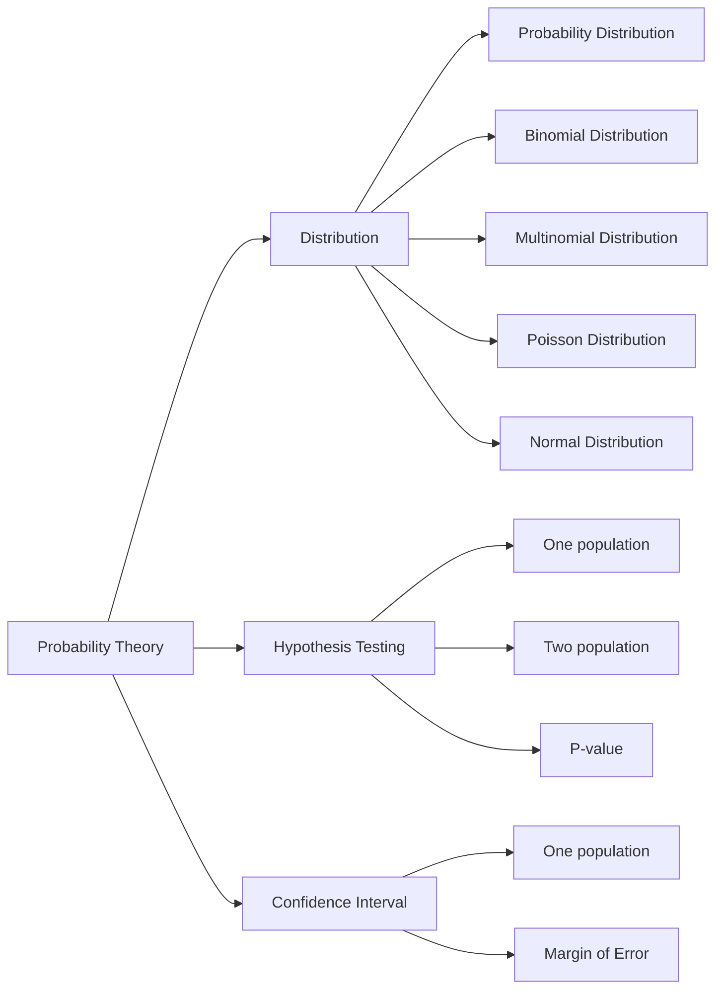

# 2022-2023学年第二学期概率论复习课
> written by 20电美刘庆宇

## 一、Distribution
### ① Probability Distribution
1. Probablity Distribution:
   
   |x|0|1|2|3|
   |-|-|-|-|-|
   |**P(x)**|||||
2. Mean(均值): $\mu = \sum{x\cdot P(x)}$
3. Variance(方差): $\sigma^2=\sum{x^2\cdot P(x)-\mu^2}$
4. Standard deviation(标准差): $\sigma=\sqrt{\sum{x^2\cdot P(x)-\mu^2}}$
5. Expected Value(数学期望): $E(x)=\mu = \sum{x\cdot P(x)}$
### ② Binomial Distribution
1. $P(x)=C_n^x \cdot p^x\cdot q^{n-x}= \displaystyle\frac{n!}{(n-x)!x!}\cdot p^x\cdot q^{n-x}$
   > $P(x\leq3)=P(0)+P(1)+P(2)+P(3)$
   > 
   > $P()=P()+$
2. Mean(均值): $\mu = np$
3. Variance(方差): $\sigma^2=npq$
4. Standard deviation(标准差): $\sigma=\sqrt{npq}$
### ③ Multinomial Distribution
1. $P(M) = \displaystyle\frac{n!}{x_1!x_2!\cdots x_k!}P_1^{x_1}\cdot P_2^{x_2}\cdots P_k^{x_k}$
  
   $(x_1 + x_2 + \cdots + x_k = n)$
### ④ Poisson Distribution
N很大，p很小，变量在一段时间内发生

1. $P(x, \lambda) = \displaystyle\frac{e^{-\lambda}\cdot \lambda^x}{x!}$
   - $x = 1, 2, 3\cdots$
   - λ是单位时间(或单位面积)内随机事件的平均发生次数
     - 如果题目中$\lambda$未给出，使用公式$\lambda = np$
### ⑤ Normal Distribution
1. 性质：
   - 均值，中位数和众数（mean, medeian and mode）相等
   - Symmetrical 对称
   - Continuous 连续
   - Unimodal 单峰
   - No touch the X-axis 不接触x轴
   - Total area is 1
   - 36特性：68-95-99.7
  
     
2. Standard Normal Distribution (标准正态分布)
   
   $\mu = 0,\,\sigma = 1$
3. Z-table 标准正态分布表 (课本P227)
4. Standard Normal Score: $z = \displaystyle\frac{x-\mu}{\sigma}$
   - 作用：把正态分布转换为标准正态分布, 算出z后根据z求P
5. Central Limit Theory (中心极限定理): $z = \displaystyle\frac{\bar{x}-\mu}{\sigma_{\bar{x}}} = \displaystyle\frac{\bar{x}-\mu}{\sigma/\sqrt{n}}$
   > Standard score for distribution of sample means 
6. Sampling without replacement (不重复抽样)   
   - 当$n>N\cdot 5$%, 使用校正系数correction$\sqrt{\displaystyle\frac{N-n}{N-1}}$
   - Standard Error of Means:

     $\sigma_{\bar{x}}=\displaystyle\frac{\sigma}{\sqrt{n}}\cdot\sqrt{\displaystyle\frac{N-n}{N-1}}$
   - $z=\displaystyle\frac{\bar{x}-\mu}{\displaystyle\frac{\sigma}{\sqrt{n}}\cdot\sqrt{\displaystyle\frac{N-n}{N-1}}}$
  
   |Population|Sampling with replacement|Sampling without replacement|
   |-|-|-|
   |$z = \displaystyle\frac{x-\mu}{\sigma}$|$z =  \displaystyle\frac{\bar{x}-\mu}{\sigma/\sqrt{n}}$|$z=\displaystyle\frac{\bar{x}-\mu}{\displaystyle\frac{\sigma}{\sqrt{n}}\cdot\sqrt{\displaystyle\frac{N-n}{N-1}}}$|

   > On the exam, you will only think of this coreection if I mention **Sampling without replacement** or **finite population**. Otherwise assume sampling with replacement. 
   > 
   > 在考试中，只有当我提到 **Sampling without replacement** 或 **finite population**时，你才会想到这个correction。否则，假设 重复抽样。
7. The normal approximation to the binomial distribution (二项分布的正态近似)

   
   
   Procedure for the Normal Approximation to the Binomial Distribution:
   1. Check if Normal Approximation can be used.
      - $np\geq5$ and $nq\geq5$
   2. Find mean and standard deviation.
      - $\mu=np$, $\sigma=\sqrt{npq}$
   3. Write P(X)
      - Example: P(x=8)
   4. Rewrite using continuity correction factor and show area
      - Example: P(7.5 $\leq$ x $\leq$ 8.5)
   5. Find z value.
      - $z=\displaystyle\frac{x-np}{\sqrt{npq}}$
   6. Solve.
      - Caculate probability
## 二、Hypothesis Testing
> 假设检验解题步骤：
> 
> 0. 列出题中数据：
>    |claim|=<>|
>    |-|-|
>    |n|?|
>    |$\mu$|?|
>    |$\bar{x}$|?|
>    |$\sigma$|?|
>    |$\alpha$|?|
>    |...|...|
> 1. Hypothesis
>    - $H_0: =、\leq、\geq$
>    - $H_1: ≠、<、>$
> 2. Critical value + Diagram
>    - 根据$\alpha$和Test类型，看table画diagram
> 3. Test value
>    - 把数据套进对应公式
> 4. Decision
>    - xxx is (not) in the critical region. (Don't) Reject $H_0$
> 5. Conclusion (当claim错误应该说不支持)
>    - There is (not) enough statistical to support the claim that...
>    - Error I is possible (when $H_0$ is rejected)
>    - Error II is possible (when $H_0$ is received)
1. 3种Test:
   1. One tailed Left Test:
      
      
   2. One tailed Right Test:
      
   3. Two tailed Test:
      
      
2. 3种table
   
   |Type|Characteristics|
   |-|-|
   |z-table|Area under|
   |t-table|d.f.; Area below|
   |$\chi^2$-table|d.f.; Area below|
3. Test Value: One population
   ||Formula|d.f.|Table type|
   |-|-|-|-|
   |$\sigma$ is known|$z=\displaystyle\frac{\bar{x}-\mu}{\sigma/\sqrt{n}}$|None|z-value + z-table|
   |$\sigma$ is unknown & $n>30$|$z=\displaystyle\frac{\bar{x}-\mu}{s/\sqrt{n}}$|None|z-value + z-table|
   |$\sigma$ is unknown & $n<31$|$t=\displaystyle\frac{\bar{x}-\mu}{s/\sqrt{n}}$|$d.f=n-1$|t-value + t-table|
   |Proportions|$z=\displaystyle\frac{\bar{x}-np}{\sqrt{npq}}$|None|z-value + z-table|
   |Variance|$\chi^2 = \displaystyle\frac{(n-1)s^2}{\sigma^2}$|$d.f = n-1$|$\chi^2$-value + $\chi^2$-table|
   |Goodness of Fit|$\chi^2=\sum\displaystyle\frac{(O-E)^2}{E}$|$d.f =$ number of categories minus 1|$\chi^2$-value + $\chi^2$-table|
   |t-test for the Correlation Coefficient|$t = r\displaystyle\sqrt{\frac{n-2}{1-r^2}}$|$d.f = n-2$|t-value + t-table|

   Correlation Coefficient Formula: $$r = \displaystyle\frac{n(\sum xy)-(\sum x)(\sum y)}{\sqrt{[n(\sum x^2)-(\sum x)^2]\cdot[n(\sum y^2)-(\sum y)^2]}}$$

4. Test Value: Two population
   ||Formula|d.f.|Table type|
   |-|-|-|-|
   |$\sigma_1、\sigma_2$ are known|$z = \displaystyle\frac{(\bar{x}_1-\bar{x}_2)-(\mu_1-\mu_2)}{\sqrt{\displaystyle\frac{\sigma_1^2}{n_1}+\frac{\sigma_2^2}{n_2}}}$|None|z-value + z-table|
   |$\sigma_1、\sigma_2$ are unknown & $n_1>30,n_2>30$|$z = \displaystyle\frac{(\bar{x}_1-\bar{x}_2)-(\mu_1-\mu_2)}{\sqrt{\displaystyle\frac{s_1^2}{n_1}+\frac{s_2^2}{n_2}}}$|None|z-value + z-table|
   |$\sigma_1、\sigma_2$ are unknown & $n_1<31,n_2<31$ & Variances unequal|$t = \displaystyle\frac{(\bar{x}_1-\bar{x}_2)-(\mu_1-\mu_2)}{\sqrt{\displaystyle\frac{s_1^2}{n_1}+\frac{s_2^2}{n_2}}}$|$d.f={min}\{n_1-1,n_2-1\}$|t-value + t-table|
   |$\sigma_1、\sigma_2$ are unknown & $n_1<31,n_2<31$ & Variances equal|$t = \displaystyle\frac{(\bar{x}_1-\bar{x}_2)-(\mu_1-\mu_2)}{\sqrt{\displaystyle\frac{(n_1-1)s_1^2+(n_2-1)s_2^2}{n_1+n_2-2}}\cdot\sqrt{\displaystyle\frac{1}{n_1}+\frac{1}{n_2}}}$|$d.f=n_1+n_2-2$|t-value + t-table|
   |Proportions|$z = \displaystyle\frac{(\hat{p}_1-\hat{p}_2)-(p_1-p_2)}{\sqrt{\bar{p}\cdot\bar{q}\cdot\left(\displaystyle\frac{1}{n_1}+\frac{1}{n_2}\right)}}$|None|z-value + z-table|

   Proportions：

   |Probability|Formula|
   |-|-|
   |$\bar{p}$|$\displaystyle\frac{x_1+x_2}{n_1+n_2}$|
   |$\bar{q}$|$1-\bar{p}$|
   |$\hat{p}_1$|$\displaystyle\frac{x_1}{n_1}$|
   |$\hat{p}_2$|$\displaystyle\frac{x_2}{n_2}$|
5. P-value (0522)
   - P-value<$\alpha\cdots\,\cdots$ Reject$\,H_0$
   - P-value>$\alpha\cdots\,\cdots$ Don't reject$\,H_0$

   > Don't use P-value if the question doesn't ask for it. Use critical value. (如果题目中没有要求使用P-value，就不要使用P-value，使用C.V。)
6. Possible Relationships between Variable: When $H_0$ has been rejected for a specifc $\alpha$, any the following five possibilities can exist.
   - There is a direct cause and effect relationship between thevariables. (直接因果)
   - There is a reverse cause and effect relationship between thevariables. (反向因果)
   - The relationship between the variables may be caused by a third variable. (变量之间的关系可能是由第三个变量引起的。)
   - There may be complexity of interrelationships among manyvariables. (许多变量之间的相互关系可能是复杂的)
   - The relationship may be coincidental. (关系可能是巧合产生的)
## 三、Confidence Interval
1. One population
   
   ||Formula|d.f.|Table type|
   |-|-|-|-|
   |$\sigma$ is known|$\bar{x}-z_{\frac{\alpha}{2}}\left(\displaystyle\frac{\sigma}{\sqrt{n}}\right)<\mu<\bar{x}+z_{\frac{\alpha}{2}}\left(\displaystyle\frac{\sigma}{\sqrt{n}}\right)$|None|z-value + z-table|
   |$\sigma$ is unknown & $n>30$|$\bar{x}-z_{\frac{\alpha}{2}}\left(\displaystyle\frac{s}{\sqrt{n}}\right)<\mu<\bar{x}+z_{\frac{\alpha}{2}}\left(\displaystyle\frac{s}{\sqrt{n}}\right)$|None|z-value + z-table|
   |$\sigma$ is unknown & $n<31$|$\bar{x}-t_{\frac{\alpha}{2}}\left(\displaystyle\frac{s}{\sqrt{n}}\right)<\mu<\bar{x}+t_{\frac{\alpha}{2}}\left(\displaystyle\frac{s}{\sqrt{n}}\right)$|$d.f.= n-1$|t-value + t-table|
   |Proportions|$\hat{p}-z_{\frac{\alpha}{2}}\sqrt{\displaystyle\frac{\hat{p}\hat{q}}{n}}<p<\hat{p}+z_{\frac{\alpha}{2}}\sqrt{\displaystyle\frac{\hat{p}\hat{q}}{n}}$|None|z-value + z-table|
   |Variance|$\displaystyle\frac{(n-1)s^2}{\chi^2_{large}}<\sigma^2<\frac{(n-1)s^2}{\chi^2_{small}}$|$d.f.= n-1$|$\chi^2$-value + $\chi^2$-table|
   |Standard Deviation|$\displaystyle\sqrt{\frac{(n-1)s^2}{\chi^2_{large}}}<\sigma<\sqrt{\frac{(n-1)s^2}{\chi^2_{small}}}$|$d.f.= n-1$|$\chi^2$-value + $\chi^2$-table|

2. Margin of Error
   
   $E = z_{\frac{\alpha}{2}}\left(\displaystyle\frac{\sigma}{\sqrt{n}}\right)$
   
   $n=\left(\displaystyle\frac{z_{\frac{\alpha}{2}}\cdot\sigma}{E}\right)^2$

## 考试
|题型|数量|单道分值|总分值|
|-|-|-|-|
|选择|10|2|20|
|大题|8|10|80|

> 1. 3个table会被提供
> 2. 任何公式考卷都不会提供
> 3. 计算器可以带